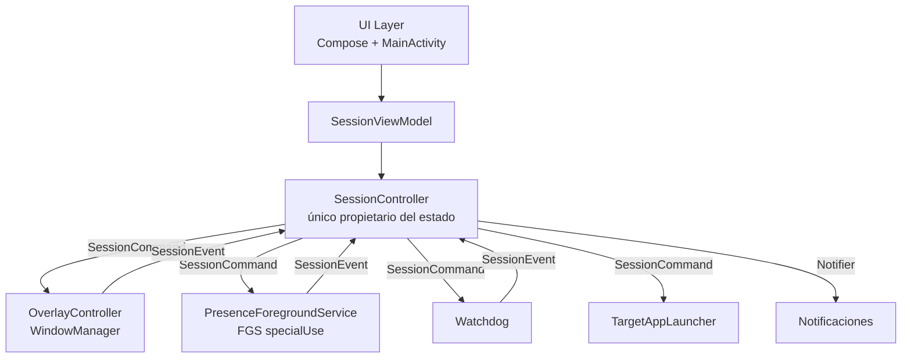

# Architecture Spine — stayAlert

## Design Paradigm

**Layered + single-activity + UDF** (recomendación oficial Android). Una sola `MainActivity` (Compose); capas UI / domain / data; ViewModel como state holder; corrutinas + Flow. El estado de sesión es un flujo unidireccional: los componentes del sistema operativo (overlay, FGS, watchdog) son **clientes** que reportan eventos al controlador central y reciben órdenes — nunca mutan estado por su cuenta.



## Invariants & Rules

### AD-1 — SessionController es el único propietario del estado de sesión

- **Binds:** FR-5, FR-6, FR-7, FR-11, FR-12, FR-13, FR-14, FR-16, FR-17
- **Prevents:** dos componentes mutando el estado de sesión de forma divergente (p. ej. el watchdog terminando la sesión mientras la UI la muestra activa)
- **Rule:** El estado de sesión es una sealed class `SessionState { Inactiva, Lanzando, Aislada, Deteniendo }` expuesta como `StateFlow<SessionState>` por `SessionController`. Ningún otro componente muta el estado; los componentes SO reportan eventos (`SessionEvent`) y el controlador decide las transiciones. `[ADOPTED]`

### AD-2 — Los componentes del SO son clientes, no orquestadores

- **Binds:** FR-6, FR-11, FR-13, FR-14
- **Prevents:** el FGS o el overlay iniciando/terminando sesiones por su cuenta
- **Rule:** `OverlayController`, `PresenceForegroundService` y `Watchdog` no se comunican entre sí; solo con `SessionController` (órdenes entrantes, eventos salientes). El FGS se inicia **después** de que el overlay esté visible (regla Android 15: overlay visible antes de FGS desde background). `[ADOPTED]`

### AD-3 — TargetAppLauncher es una interfaz inyectada con contrato de error

- **Binds:** FR-4, FR-5, FR-6
- **Prevents:** el lanzamiento de la app objetivo acoplado al código de producción e inyectable en tests; semántica de error ambigua
- **Rule:** `TargetAppLauncher` (interfaz) con dos implementaciones: `IntentLauncher` (producción: Intent explícito a paquete+actividad configurados) y `FakeLauncher` (tests). **Contrato de error:** `suspend fun launch(target: TargetApp): Result<Unit>` — nunca lanza excepciones; `Result.failure` con `LaunchError` (paquete no instalado, actividad no resuelta, fallo del sistema). Inyección por constructor (DI manual; sin Hilt en v1). `[ADOPTED]`

### AD-4 — OverlayController: ventana del sistema con contrato fijo

- **Binds:** FR-6, FR-8, FR-9, FR-10
- **Prevents:** variaciones de flags/permisos que rompan el aislamiento visual o el patrón de salida
- **Rule:** Ventana `TYPE_APPLICATION_OVERLAY` (minSdk 26) creada vía `createWindowContext`; flags `FLAG_NOT_FOCUSABLE` + `FLAG_LAYOUT_IN_SCREEN` + `FLAG_KEEP_SCREEN_ON` + `FLAG_SECURE`; fondo `#000000` opaco; **sin** `FLAG_NOT_TOUCHABLE` (debe recibir el patrón de salida). Detector de patrón: 4 taps en región 15% ancho × 15% alto (esquina superior derecha), ventana temporal 500 ms. `[ADOPTED]`

### AD-5 — Watchdog: detección y gating por estado

- **Binds:** FR-12, FR-13, FR-14, FR-16
- **Prevents:** sesiones muertas en silencio (overlay huérfano, pantalla apagada, permiso revocado); falsas terminaciones durante Lanzando/Deteniendo
- **Rule:** El watchdog **solo está activo en estado `Aislada`** (iniciado/detenido por órdenes del controlador). Detecta: pantalla apagada (`PowerManager`), overlay ausente o permiso revocado (`Settings.canDrawOverlays()`), app objetivo fuera de primer plano (`UsageStatsManager` si el permiso de uso está concedido; si no, limitación documentada), `HIDE_OVERLAY_WINDOWS` (overlay no dibujado sobre la app objetivo), y nivel de batería (aviso al 15%, terminación al 5%). **El watchdog solo detecta y emite eventos — nunca publica notificaciones.** Polling cada 2 s (cumple SLA < 5 s de FR-13). `[ADOPTED]`

### AD-6 — Configuración en DataStore, sesión efímera

- **Binds:** FR-3, FR-4, FR-17
- **Prevents:** persistir estado de sesión (inconsistencia tras kill) o config en SharedPreferences (legado)
- **Rule:** `DataStore Preferences` para: app objetivo (paquete+actividad), aviso de uso responsable aceptado, exención de batería completada. El estado de sesión **no** se persiste; tras kill del proceso, la sesión termina y el estado es `Inactiva`. `[ADOPTED]`

### AD-7 — Contrato de comandos y handshake Lanzando→Aislada

- **Binds:** FR-6, FR-7, FR-11, FR-13
- **Prevents:** dos implementaciones incompatibles del protocolo de órdenes (Collision 1: handshake colgado en Lanzando)
- **Rule:** El controlador emite `SessionCommand` (sealed class): `ShowOverlay`, `HideOverlay`, `StartFgs`, `StopFgs`, `StartWatchdog`, `StopWatchdog`, `LaunchTarget`. **Semántica:** todas las órdenes son fire-and-forget (no retorno síncrono de confirmación); la confirmación llega como `SessionEvent`. **Handshake Lanzando→Aislada:** la transición ocurre **solo** al recibir `SessionEvent.OverlayShown`; `ShowOverlay` no confirma por retorno. Si llega `OverlayFailed` o `LaunchFailed`, la sesión aborta a `Inactiva` con notificación. `[ADOPTED]`

### AD-8 — Notifier: único publicador de notificaciones

- **Binds:** FR-11, FR-12, FR-13, FR-14, FR-16
- **Prevents:** notificaciones duplicadas o perdidas por carrera con `stopForeground` (Collision 2); canales con IDs divergentes
- **Rule:** `Notifier` (inyectado) es el **único** componente que publica notificaciones. `SessionController` es el único que ordena publicar (vía `Notifier`). El watchdog y el FGS **nunca** publican. Canales fijos: `stayalert_session` (FGS persistente, creado al iniciar la app) y `stayalert_events` (avisos y fin de sesión). La acción "Detener" de la notificación FGS enruta a un `BroadcastReceiver` que emite `SessionEvent.StopRequested`. `[ADOPTED]`

### AD-9 — Concurrencia: event loop de consumidor único y terminación idempotente

- **Binds:** FR-7, FR-11, FR-12, FR-13
- **Prevents:** carreras entre 4-taps, acción Detener y watchdog (Collision 2/3: doble terminación, doble destroy)
- **Rule:** `SessionController` procesa `SessionEvent` en un **único dispatcher** (canal `Channel` con consumidor único). **La terminación es idempotente:** eventos de terminación recibidos en `Deteniendo` o `Inactiva` son no-ops. Los eventos recibidos en un estado que no los admite se ignoran (p. ej. anomalías en `Lanzando`). `[ADOPTED]`

### AD-10 — Contrato de eventos y vocabulario de motivos

- **Binds:** FR-6, FR-7, FR-12, FR-13, FR-14, FR-16
- **Prevents:** dos definiciones incompatibles de `SessionEvent` y del enum de motivos (H-1)
- **Rule:** `SessionEvent` (sealed class) con subclases fijas: `PatternDetected`, `StopRequested`, `OverlayShown`, `OverlayFailed(cause)`, `LaunchFailed(cause)`, `ScreenOff`, `OverlayMissing`, `PermissionRevoked`, `TargetLeftForeground`, `TargetCrashed`, `HideOverlayWindows`, `BatteryWarning(level)`, `BatteryCritical(level)`. El motivo de la notificación de fin de sesión se deriva del evento de terminación (enum `TerminationReason { Pattern, ManualStop, ScreenOff, OverlayMissing, PermissionRevoked, TargetLeftForeground, TargetCrashed, HideOverlayWindows, BatteryCritical, LaunchFailed, OverlayFailed }`); el mapeo motivo→texto vive en `Notifier`. `[ADOPTED]`

### AD-11 — ForegroundMonitor: confirmación de primer plano con seam de test

- **Binds:** FR-6, FR-13
- **Prevents:** la confirmación de primer plano de FR-6 sin mecanismo ni seam de test (H-4)
- **Rule:** `ForegroundMonitor` (interfaz inyectada) confirma si la app objetivo está en primer plano. Implementación de producción: `UsageStatsManager` (si el permiso de uso está concedido; si no, devuelve `Unknown` y la confirmación se omite — limitación documentada). Implementación de test: fake determinista. `SessionController` usa `ForegroundMonitor` para la confirmación de FR-6 y el watchdog para la detección de salida de primer plano. `[ADOPTED]`

### AD-12 — Clock inyectable

- **Binds:** FR-6, FR-13
- **Prevents:** delays y SLA no testeables en JVM/Robolectric (M-3)
- **Rule:** `Clock` (interfaz inyectada) provee el tiempo para: el delay de 1 s entre lanzamiento y overlay (FR-6), la ventana temporal del patrón de salida (500 ms, AD-4), y el SLA del watchdog (< 5 s, AD-5). Implementación de producción: `SystemClock`; implementación de test: fake con control manual. `[ADOPTED]`

## Consistency Conventions

| Concern | Convention |
| --- | --- |
| Naming | Componentes SO con sufijo `Controller`/`Service`/`Watchdog`; eventos `SessionEvent`; estados `SessionState`; órdenes `SessionCommand` |
| Estado | `SessionState` sealed class; transiciones solo en `SessionController` (AD-1, AD-9) |
| Errores | Fallos de componentes SO → `SessionEvent` (nunca excepciones cruzando capas); `TargetAppLauncher` devuelve `Result` (AD-3) |
| Config | DataStore Preferences; claves en `SettingsKeys`; constantes de sesión (1 s delay, 500 ms ventana, 15%/5% batería, 2 s polling, SLA 5 s) en un objeto `SessionConstants` (no hardcodeadas) |
| Permisos | `PermissionAuditor` es el **único** lector del estado de permisos (FR-1, FR-5, FR-13); el watchdog consume sus datos vía evento, no re-lee |
| Notificaciones | Canales fijos `stayalert_session` y `stayalert_events`; único publicador `Notifier` (AD-8) |
| Tiempo | `Clock` inyectable para todo delay/SLA (AD-12) |

## Stack

| Name | Version |
| --- | --- |
| Kotlin | 2.4.x |
| Jetpack Compose (BOM) | 2026.06.x |
| AndroidX Lifecycle (ViewModel, StateFlow) | BOM |
| DataStore Preferences | BOM |
| AGP | 9.3.0 |
| Gradle | 9.5+ |
| JDK | 17 |
| minSdk / targetSdk | 26 / 36 |
| Testing | JUnit4, Robolectric 4.16, Compose UI tests, UI Automator |

## Structural Seed

```text
app/
  src/main/java/com/stayalert/
    ui/            # Compose: MainActivity, pantalla principal, configuración, aviso modal
    domain/        # SessionController, SessionState, SessionEvent, SessionCommand,
                   #   TerminationReason, TargetAppLauncher, ForegroundMonitor, Clock
    data/          # SettingsRepository (DataStore), PermissionAuditor, Notifier
    system/        # OverlayController, PresenceForegroundService, Watchdog,
                   #   IntentLauncher, UsageStatsForegroundMonitor, StopReceiver
  src/test/        # unit tests (JVM/Robolectric): SessionController, patrón 4-taps,
                   #   watchdog, handshake, idempotencia (fakes: launcher, monitor, clock)
  src/androidTest/ # instrumented: Compose UI tests, UI Automator E2E contra mock,
                   #   kill-switch (BroadcastReceiver)
mock-teams/        # APK de prueba con package com.microsoft.teams (componentes declarados)
                   #   — excluido de builds de release (variant/build-type)
```

## Capability → Architecture Map

| Capability / Area | Lives in | Governed by |
| --- | --- | --- |
| Onboarding y permisos (FR-1..FR-3) | `ui/` + `data/PermissionAuditor` | AD-6, convención permisos |
| Configuración app objetivo (FR-4) | `data/SettingsRepository` + `domain/TargetAppLauncher` | AD-3, AD-6 |
| Inicio/despliegue secuencial (FR-5, FR-6) | `domain/SessionController` + `system/` | AD-1, AD-2, AD-4, AD-7, AD-11, AD-12 |
| Patrón de salida (FR-7) | `system/OverlayController` | AD-4, AD-9 |
| Overlay y retención (FR-8..FR-10) | `system/OverlayController` | AD-4 |
| FGS y kill switch (FR-11) | `system/PresenceForegroundService` + `system/StopReceiver` | AD-2, AD-8 |
| Feedback y watchdog (FR-12..FR-16) | `system/Watchdog` + `domain/SessionController` + `data/Notifier` | AD-5, AD-8, AD-9, AD-10 |
| Recuperación ante kill (FR-17) | `domain/SessionController` | AD-1, AD-6 |

## Deferred

- **Hilt** — DI manual suficiente para el tamaño; migrar si crece la complejidad.
- **Lista de apps instaladas** (FR-4 v2) — entrada manual en v1.
- **Reanudación tras reinicio** (FR-17 v2) — requiere persistir estado de sesión (contradice AD-6).
- **Modo pantalla apagada** (v3) — requiere validación empírica del comportamiento de Teams.
- **Distribución Play** — requiere disclosure de accesibilidad (no aplica: sin AccessibilityService en v1) y declaración FGS specialUse.
- **Multi-app objetivo simultáneo** (v3) — una sesión, una app objetivo.
- **Confirmación de primer plano sin permiso de uso** — `ForegroundMonitor` devuelve `Unknown` y la confirmación se omite (limitación aceptada, AD-11).
